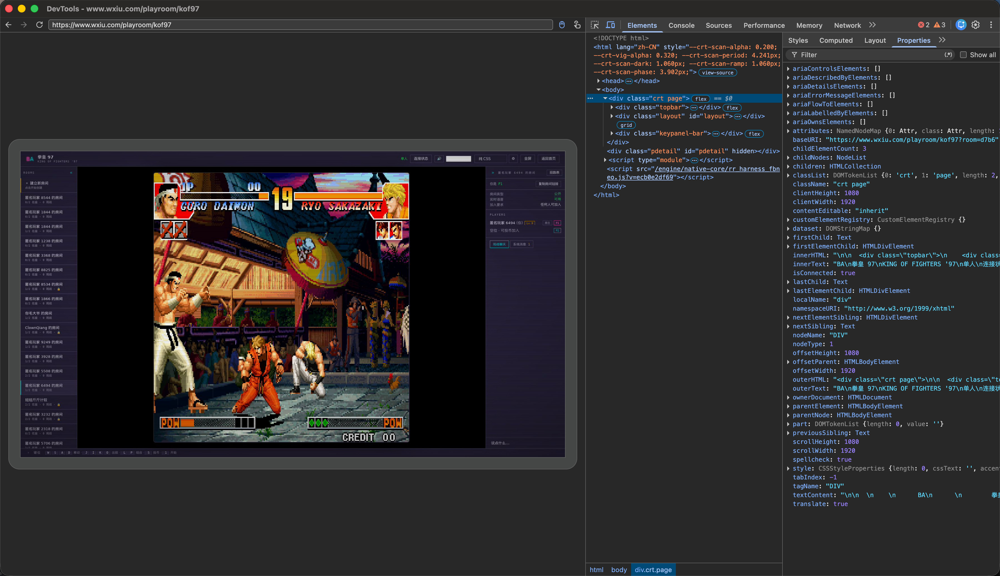
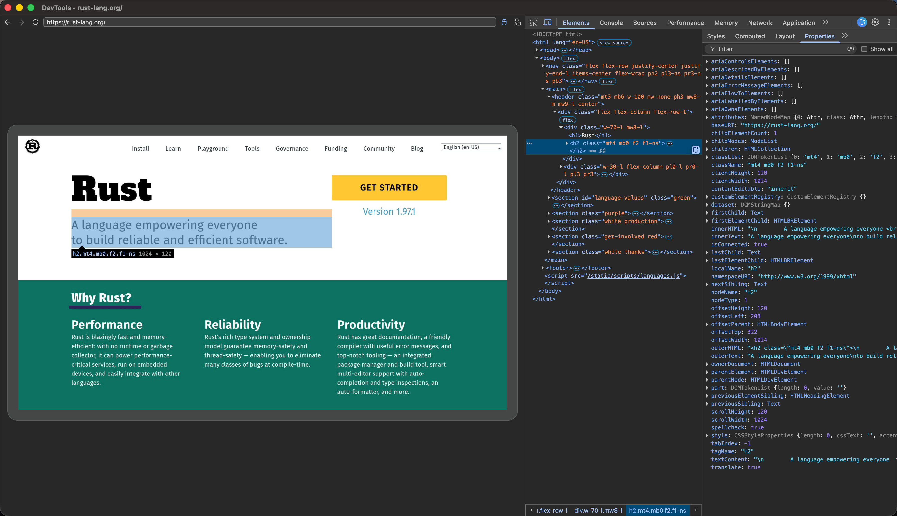
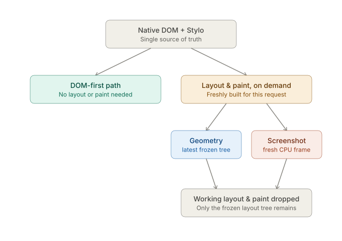
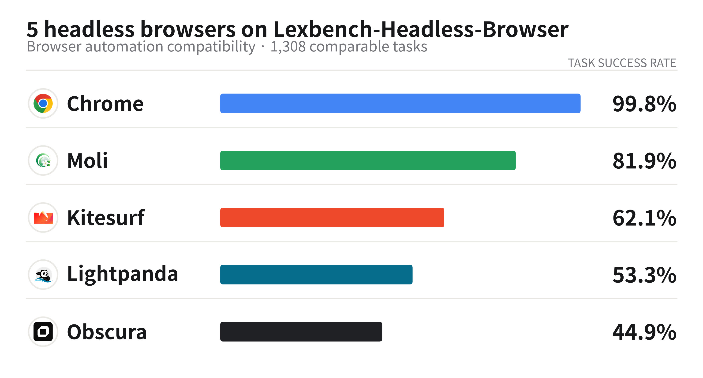
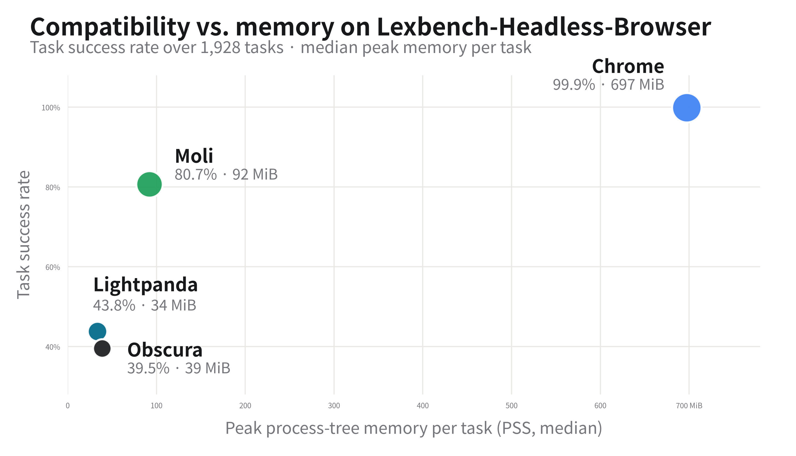

<p align="center">
  
</p>

<h1 align="center">Moli</h1>

<p align="center">
  <a href="../README.md">English</a> |
  <strong>简体中文</strong> |
  <a href="README.ja.md">日本語</a> |
  <a href="README.de.md">Deutsch</a> |
  <a href="README.fr.md">Français</a> |
  <a href="README.es.md">Español</a>
</p>

Moli 是一款面向 AI 智能体、可用于生产环境的无头浏览器。它采用按需布局与渲染的设计，兼顾完整的浏览器运行时与轻量的资源占用。

Moli 可以帮助你的 AI 智能体抓取和提取网页、搜索网络，以及自动化各类浏览器任务。

你可以通过 CLI、CDP、WebDriver Classic 或 WebDriver BiDi 来使用它。

Moli 支持 Linux、macOS 和 Windows。

## 快速开始

把这句话发给你的 AI 智能体：

```text
安装 https://github.com/lexmount/moli/tree/main/skills 下面的 skills，
根据 skills 指引下载并安装最新版预编译 Moli 二进制，然后用 moli-webfetch
抓取 https://example.com 并把结果给我。
```

### 直接安装

在 Linux 或 macOS 上：

```sh
curl --proto '=https' --tlsv1.2 -fsSL \
  https://github.com/lexmount/moli/releases/latest/download/moli-installer.sh | sh
```

在 Windows 上，请在 PowerShell 中运行：

```powershell
irm https://github.com/lexmount/moli/releases/latest/download/moli-installer.ps1 | iex
```

## 效果展示

<p align="center">
  <a href="../assets/moli-game.jpg">
    
  </a>
</p>

<p align="center">
  <sub>由 Moli 渲染并通过 Chrome DevTools 实时检查的 HTML5 游戏。</sub>
</p>

<p align="center">
  <a href="../assets/moli-devtools-rust-lang.jpg">
    
  </a>
</p>

<p align="center">
  <sub>由 Moli 渲染的 rust-lang.org，其实时 DOM、CSS 和几何信息可在 Chrome DevTools 中查看。</sub>
</p>

## CLI 用法

### 提取页面

使用 Moli 默认的完成策略，将页面渲染为 Markdown：

```bash
moli fetch \
  --dump markdown \
  --wait-until done \
  https://example.com
```

也可以直接返回结构紧凑、便于模型处理的语义树：

```bash
moli fetch \
  --dump semantic_tree_text \
  --wait-selector body \
  https://example.com
```

如果需要视觉输出，可以直接生成截图、长截图或 PDF：

```bash
moli fetch --layout --dump screenshot https://example.com > page.png
moli fetch --layout --dump screenshot_full https://example.com > full-page.png
moli fetch --layout --dump pdf https://example.com > page.pdf
```

运行 `fetch --help` 可以查看完整的参数列表，包括输出格式、页面加载/响应等待条件、配置文件、代理设置、资源策略和跟踪选项。

### 启动自动化服务器

```bash
# 面向 DOM 优先工作负载的基础自动化服务器
moli serve

# 启用真实几何信息、坐标输入以及截图/屏幕串流功能
moli serve --layout

# 同时获取可选的图片、字体、音频、视频、媒体和文本轨道资源
moli serve --layout --resource
```

同一个端点会同时提供 CDP、WebDriver Classic 和 WebDriver BiDi 三种协议。Playwright 可以直接通过 CDP 连接：

```js
import { chromium } from "playwright";

const browser = await chromium.connectOverCDP("http://127.0.0.1:9222");
const context = browser.contexts()[0];
const page = context.pages()[0] ?? await context.newPage();

await page.goto("https://example.com");
console.log(await page.locator("body").innerText());

await browser.close();
```

## 为什么选择 Moli

对智能体工作负载来说，最重要的是三项特质，而 Moli 把它们结合在了一起：

- **功能完整**——真实的 JavaScript、DOM、CSS、网络、存储、布局、截图和标准自动化协议，全部集成在同一个无头浏览器里。
- **速度快**——多数自动化请求根本用不到视觉渲染，结构优先的操作会直接跳过布局和绘制。
- **资源高效**——布局和像素只在需要时才生成，Moli 不必持续维护和更新一整套已经渲染好的视觉状态。

多数浏览器自动化任务真正需要的是页面结构，而不是一个持续渲染的可视世界。Moli 把原生 DOM 和样式状态当作唯一的事实来源，只有确实需要布局或软件绘制的操作，才会触发相应的计算。

| 智能体请求 | Moli 的处理方式 |
| --- | --- |
| 提取 HTML/Markdown、查询 DOM、运行 JS、检查网络/存储 | 直接读取浏览器运行时状态——不触发布局或绘制 |
| 读取元素边界框、对某个坐标做命中测试、发送坐标输入 | 执行一次布局计算，只保留最新的冻结布局树 |
| 截图或刷新屏幕串流 | 根据当前 DOM/样式重新构建并替换冻结树，渲染新的一帧，帧用完即丢弃 |

<p align="center">
  <a href="../assets/moli_ondemand_rendering_flow.svg">
    
  </a>
</p>

Moli 依然内置了 V8、CSS、布局、文本排版、命中测试和软件绘制等完整能力，区别只在于：视觉相关的工作*什么时候*执行，以及计算结果*保留多久*。这套成本模型特别适合网页抓取、浏览器操作智能体、检索流水线、评测环境和强化学习工作负载。

## 目前支持的能力

- **完整的 Web 运行时**——流式 HTML 解析、原生 DOM、V8 JavaScript、模块/定时器/微任务/事件、iframe 与 worker、CSS 层叠、Fetch/XHR/WebSocket、Cookie、WebCrypto，以及按配置文件隔离的存储（localStorage、IndexedDB、OPFS）。
- **面向提取优化的输出**——CLI 可以直接输出 HTML、Markdown、JSON、语义文本树，以及带帧信息的序列化结果，并支持按选择器/脚本/响应等待和网络跟踪。
- **统一的自动化程序**——CDP、WebDriver Classic 和 WebDriver BiDi 共用同一套内核和调度器，不需要额外安装 ChromeDriver、geckodriver 或浏览器本体。
- **按需开启真实视觉能力**——加上 `--layout` 参数后，即可使用完整的盒模型构建、Taffy 布局、Parley 文本排版、基于布局的命中测试与输入、视口截图，以及低频 CPU 渲染的 DevTools 屏幕串流。
- **可控的运维选项**——配置文件、Cookie、HTTP 缓存、代理、资源类别、连接数限制、超时、专用网络策略、User-Agent 覆盖、结构化日志和网络诊断，一应俱全。

## Moli 与 Lexmount 的关系

Moli 是 Lexmount 旗下的开源无头浏览器；Lexmount Browser 则是围绕它构建的托管云运行时与控制平面。

**不依赖 Lexmount Browser，这个开源无头浏览器本身就可以完整使用。**

## 成本控制

高成本的浏览器操作在 Moli 里都需要显式开启，而不会默认打开：

| 模式/选项 | 行为 |
| --- | --- |
| 默认 | `LayoutPolicy::Mock`——返回确定性的、格式兼容的几何信息，不执行真实的布局或绘制 |
| `--layout` | `LayoutPolicy::OnDemand`——提供真实的布局、几何信息、命中测试、坐标输入、截图和屏幕串流 |
| `--resource` | 拉取所有可选的视觉/媒体资源类别 |
| `--image`、`--font`、`--audio`、`--video`、`--media`、`--text-track` | 单独启用某一类可选资源 |
| `--profile-dir`、`--http-cache-dir`、`--cookie-file` | 按工作负载需要，选择性开启持久化能力 |

布局结果是按需采样的一份快照，而不是持续维护的状态：第一次几何请求（冷启动）会根据当前 DOM/样式构建临时工作布局树，再把工作树丢弃后无法重算的几何冻结成一棵与 DOM 无关、不可变的 `FrozenLayoutTree`，长期只保留最新的这一棵树。在此之后，即便页面发生了变化，普通几何读取也可能复用旧树；截图和屏幕串流则每次都会重新构建并替换冻结树，不会复用旧的绘制结果。

## 架构

Moli 是一个独立的浏览器内核，而不是对 Chromium 的封装。它基于 Rust 构建，有自己的一套所有权和生命周期规则，核心依赖包括：

- `libcurl`——网络传输与多请求运行时
- `html5ever`——HTML 解析
- `rusty_v8` / V8——JavaScript 执行
- Servo/Stylo——选择器、层叠与样式计算
- Taffy + Parley——盒模型与文本布局
- AnyRender/Vello CPU、`usvg` 以及 Rust 图像生态——软件渲染

文档和样式只有一个事实来源：原生 DOM 与 Stylo 的集成。每次真正的刷新，都会据此构建临时工作树，按需生成并消费一份新的绘制快照，把最终的盒与文字分片几何冻结成紧凑的 `FrozenLayoutTree`，随后丢弃工作树、样式借用、布局缓存、诊断和绘制状态。来源查询表和命中测试候选不再长期保存，而是在查询时从冻结树派生。整个系统没有增量维护的布局树、损伤区域图、保留式显示列表、GPU 合成器或持久化窗口。

## 测试数据

下面的实测数据展示了 Moli 目前的能力区间。测试覆盖真实网站、自动化客户端、Chromium/WPT 行为验证，以及大规模的 nextest 回归测试套件。

### 公开网页混合抓取测试

测试对象是 192 个公开 URL，覆盖中国国内和国际主流网站。判定成功的标准是：页面必须生成有实际意义的 JavaScript 执行后内容——仅仅返回 HTTP 200、验证质询页面、登录墙、空响应，或者只有外壳的应用界面，都不计入成功。

| 浏览器 | 有效页面 | 成功率 | 中位耗时 | RSS 中位数 |
| --- | ---: | ---: | ---: | ---: |
| **Moli** | **103** | **53.6%** | **1.43 s** | **73 MiB** |
| Chrome Headless | 101 | 52.6% | 1.43 s | 773 MiB |
| Lightpanda | 85 | 44.3% | 0.97 s | 40 MiB |
| Obscura | 57 | 29.7% | 1.30 s | 39 MiB |

### 智能体工作负载样例

| 指标 | Moli | Chromium |
| --- | ---: | ---: |
| CDP 就绪 | 34.85 ms | 169.37 ms |
| 回合活跃时间 p50 | 33.40 ms | 57.13 ms |
| PSS 峰值 | 102.46 MiB | 348.82 MiB |
| 进程数 / 线程数峰值 | 1 / 24 | 11 / 123 |

### WPT 测试

在目前用于验证 Moli 智能体浏览器功能范围的 WPT 测试集合中，一次完整运行有 **161.2 万项测试通过**。

### Moli 在 Lexbench-Headless-Browser 评测中的表现

[Lexbench-Headless-Browser](https://github.com/lexmount/Lexbench-Headless-Browser) 的完整任务集包含 1,928 道任务，覆盖裸 CDP、Playwright、Puppeteer、Selenium 等 13 个固定版本的自动化工具及 Web 平台语义。为了加入仅提供远程端点的 Kitesurf，下图采用其中 1,308 道可比任务，所有浏览器使用相同的任务筛选规则。

<picture>
  <source media="(prefers-color-scheme: dark)" srcset="../assets/lexbench-five-engine-caliber-b-dark.jpg">
  
</picture>

**Moli 0.1.1 通过了 1,071 道任务，成功率为 81.88%**，高于 Kitesurf 的 62.08%、Lightpanda 的 53.29% 和 Obscura 的 44.88%；参照引擎 Chrome 为 99.85%。Kitesurf 以 k=1 运行，未覆盖任务按未通过计，远程服务的复现条件也与本地二进制不同。完整结果见 benchmark 的[五引擎报告](https://github.com/lexmount/Lexbench-Headless-Browser/blob/kitesurf-eval/docs/reports/five-engine-report-20260813.md)。

<picture>
  <source media="(prefers-color-scheme: dark)" srcset="../assets/lexbench-efficiency-map-dark.jpg">
  
</picture>

Kitesurf 是远程服务，无法测量 CPU、内存和进程数，因此资源对比只覆盖四个本地引擎。在另一轮 557 道任务的测试中，只统计四个引擎都完成的工作。Moli 单题 CPU 中位数为 **100.6 ms**，内存峰值中位数为 **92 MiB**；Chrome 分别为 **687 ms** 和 **697 MiB**。Moli 的 CPU 时间约为 Chrome 的 15%，内存峰值约为 13%。测试方法和完整数据见 benchmark 的[资源报告](https://github.com/lexmount/Lexbench-Headless-Browser/blob/main/docs/reports/resource-card-20260812.md)。

## 项目范围

在文档所定义的智能体浏览器场景范围内，Moli 已经达到生产可用的水平，并且仍在持续开发中。

目前有意保留的边界包括：

- 不提供 GUI 浏览器、持久化窗口、GPU 合成器，也不实现保留式的多帧绘制架构。
- 不追求与 Chrome 像素级一致的渲染效果，也不提供高保真的 Canvas/WebGL/媒体播放能力。
- 在 `--layout` 模式下支持软件截图和基于光栅化的 CDP PDF 生成，但没有实现 Chrome 的全部截图/打印模式。

遇到不支持的协议路径，Moli 会直接明确报错——它不会假装某个浏览器操作、事件、网络观测或者视觉结果已经发生。

## Star 趋势

由 [lexmount/moli-metrics](https://github.com/lexmount/moli-metrics) 每小时根据 star 时间线自动生成。

<picture>
  <source media="(prefers-color-scheme: dark)" srcset="https://raw.githubusercontent.com/lexmount/moli-metrics/main/assets/star-history-dark.svg">
  
</picture>

## 许可证

除非文件或目录中另有说明，你可以自行选择依据 [Apache License 2.0](../LICENSE-APACHE) 或 [MIT License](../LICENSE-MIT) 来使用 Moli。采用独立许可证的第三方组件和测试夹具，仍然遵循各自的许可证和声明。
